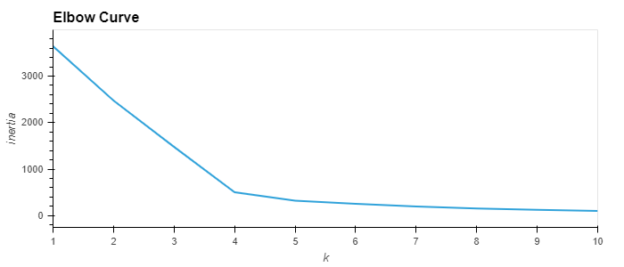
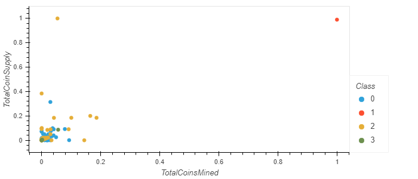

# Cryptocurrencies

## Overview

Accountability Accounting, a prominent investment bank, is interested in offering a new cryptocurrency investment portfolio for its customers. Martha is a senior manager for the Advisory Services Team at Accountability Accounting. The popularity of Bitcoin has caused a price jump that makes it unaffordable for many new investors. However, there are many other cryptocurrencies available at more affordable prices. Martha has a dataset of these cryptocurrencies and can analyze it any way she wants. 

I am helping Martha create a report that includes what cryptocurrencies are on the trading market and how they could be grouped to create a classification system for this new investment. Since we are not certain what the output could be, we have decided to use Unsupervised Machine Learning model. Also, the data is not in ideal format, so we will be processing it before using in the machine learning. 

**Programming Languages Used:** Python 3.7.9

**Softwares Used:** VS Code (1.55.2), Jupyter Notebook (6.3.0)

**Libraries Used:** Pandas, Plotly, Sklearn, hvPlot

**Data Source:** [crypto_data.csv](./Resources/crypto_data.csv) 

## Process and Results

* Data was processed by removing some rows where the coins were not minted or the cryptocurrency did not have a working algorithm
* We dropped rows with null values and also removed some of the columns which were not required for the clustering algorithms
* Columns with text values were converted into numeric values using *get_dummies()* and data was scaled using *StandardScaler()*
* Using **Principal Component Analysis (PCA)**, reduced the dimentions to three principal components
* We have used **K-means Algorithm** for clustering. Using Elbow Curve, the best number for K is found out to be 4. Then ran the K-means algorithm to make predictions of the K clusters for the cryptocurrencies’ data.

* A 3D-Scatter plot was generated with *px.scatter_3d* and plotted four clusters

* Total number of tradable cryptocurrencies were found to be 532
* Used *MinMaxScaler().fit_transform* method to scale the "TotalCoinSupply" and "TotalCoinsMined" columns
* A 2D-Scatter plot was generated with *plot_df.hvplot.scatter* method

